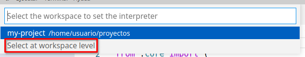

# ETS - Configurar entornos virtuales en python y workspaces en VisualCode

Cuando como programadores iniciamos in nuevo proyecto (en cualquier lenguaje de programación) tenemos que configurar un entorno para poder ejecutar nuestro proyecto.

El entorno incluye cosas como un editor, paquetes con librerías, las carpetas con los archivos de nuestro proyecto, extensiones como un depurador, un formateador y un linter específico del lenguaje de programación, etc.

Los pasos genéricos para configurar un entorno para cualquier lenguaje suele incluir los siguientes pasos:

1. Instalar el compilador/interprete del lenguaje de programación
2. Instalar un gestor de paquetes
3. Configurar el entorno virtual de trabajo
4. Configurar workspace en IDe
4. Importar apliación

Este tutorial está hecho para crear el workspace en Ubuntu 20.04. Para cualquier otro sistema operativo los pasos son los mismos, cambia la forma específica de llevarlos a cabo.

## 1. Instalación del compilador/intérprete del lenguaje de programación

En las distribuciones de Linux Python viene preinstalado con el sistema operativo, para descargar Python para otros sistemas operativos lo podemos hacer en [el siguiente enlace](https://www.python.org/downloads/)

Para comprobar la versión de Python que tenemos instalada ejecutamos en el terminal

```bash
$ python --version
Python 2.7.18
$ python3 --version
Python 3.8.10
```

## 2. Instalación de un gestor de paquetes

El gestor de paquetes de python más popular es **pip**. Para instalarlo tenemos instrucciones para hacerlo en [este enlace](https://pip.pypa.io/en/stable/installation/). En Ubuntu una de las formas de hacerlos es utilizando el gestor de paquetes del sistema **apt** ejecutando:

```bash
$ sudo apt update
$ sudo apt install python3-pip
```

Podemos comprobar que está instalado ejecutando:

```bash
$ pip --version
pip 20.0.2 from /usr/lib/python3/dist-packages/pip (python 3.8)
```

## 3. Configurando un entorno virtual

Las aplicaciones que desarrollemos en Python en muchas ocasiones utilizarán paquetes y módulos que no forman parte de la librería estándar. Las aplicaciones usarán en ocasiones una versión específica de una librería. Se puede, por tanto, dar el caso de que tengamos múltiples aplicaciones con diferentes versiones de python y con diferentes versiones de los módulos requeridos para la aplicación. Tener solo una única versión global puede no ser suficiente para nuestras necesitades.

La solución a este problema es crear un entorno virtual, una carpeta que contenga los archivos de Python para una determinada versión además de los paquetes requeridos para nuestra aplicación.

### Instalando herramienta de gestión de entornos virtuales

Hay muchas herramientas de Python disponibles para crear un entorno virtual de Python. Las más conocidas son **venv**, **virtualenv** y **pyenv** usaremos **venv** en este tutorial. Para instalarlo en Ubuntu ejecutamos:

```bash
$ sudo apt install python3-venv
```

### Creando entorno virtual para nuestro proyecto

Todo lo que hemos instalado hasta ahora es para disponer globalmente de las herramientas necesarias. Vamos ahora a preparar un **entorno virtual** para el desarrollo de nuestro proyecto. Empezamos creando la carpeta que contendrá nuestro proyecto, en este ejemplo será `my-project` 

```bash
$ mkdir proyectos
$ cd proyectos
$ mkdir my-project

```

Para crear un entorno virtual para nuestro proyecto entramos en la carpeta del proyecto y  ejecutamos el comando que crea el entorno virtual:

```bash
$ python3 -m venv venv
```

En la subcarpeta del proyecto `venv` tendremos un entorno completo con todo lo necesario para ejecutar aplicaciones de Python. 

### Activando el entorno virtual

Antes de poder trabajar en nuestro proyecto debemos activar el entorno virtual. Ejecutamos:

```bash
$ source venv/bin/activate
```
El prompt del sistema cambiará a :
```bash
(venv) $ 
```
Lo que conseguimos al crear el entorno virtual es que ahora los ejecutables de Python los busque en nuestro proyecto y no utilice los incluidos en el sistema:

```bash
$ echo $PATH
/home/usuario/proyectos/my-project/venv/bin:/usr/local/sbin:/usr/local/bin:/usr/sbin:/usr/bin:/sbin:/bin:/usr/games:/usr/local/games:/snap/bin
$ which python3
/home/usuario/proyectos/my-project/venv/bin/python3
```

Si quisieramos desactivar el entorno virtual ejecutaríamos:

```bash
(venv) $ deactivate
$
```

## 4. Configurando workspace en el IDE

Para instalar Vscode en Ubuntu ejecutamos:

```bash
$ sudo snap install code --classic
```

Una vez abierto pasamos a crear el **workspace**. Un workspace es un proyecto que contiene uno o más directorio principales (root folders), incluyendo toda la configuración de visual code para ese proyecto. La configuración incluye configuración de Visual Code, extensiones y  configuración de depuración.

El tener un workspace nos permite copiarlo de un ordenador a otro sin perder la configuración y nos permite compartirlo con otras personas.

### 4.1. Creando el workspace

1. Abre Visual Code. Si hay un directorio o workspace abierto, ciérralos.
    a) Si tienes un directorio o workspace abierto,  en el menu “file” aparece al final la opción activa “close folder” o “close workspace”.

   

2. Añadimos el directorio de trabajo a un nuevo workspace. Selecciona   el   menú   **Archivo**,   opción   **Añadir carpeta al área de trabajo** . Selecciona el directorio de inicio de nuestro proyecto **my-project**.

3. Guarda el workspace, seleccionando en el menú **Archivo**, la opción **Guardar el área de trabajo como...**. Selecciona el mismo directorio de trabajo para guardarlo. El archivo debe tener la extensión `.code-workspace`.  Lo podemos llamar, por ejemplo, `my-project.code-workspace`

Cuando quieras abrir el workspace puedes pulsar directamente sobre  el archivo con la extensión   `.code-workspace`   o   desde   VisualCode seleccionar el menú “file”, opción “open workspace...”

## 4.2. Seleccionando el interprete del entorno virtual

Instalamos en Vscode la extensión de Python para VS Code. Accedemos a extensiones, ponemos python en el buscador e instalamos la extensión de Microsoft para Python


Seleccionamos interprete de Python a utilizar. El incluido por **venv** en el proyecto. Pulsamos la combinación de teclas **SHIFT + CTRL + P** para abrir la paleta de comandos y escribimos **Python:Seleccionar interprete** 


Y lo seleccionamos a nivel de workspace:



Nos mostrará el interprete incluido en el entorno virtual:


## 4.3. Creando nuestra aplicación

Para probar nuestro entorno de trabajo vamos a crear una aplicación simple que nos devuelva nuestra dirección IP.

### Accediendo al terminal

Para instalarlo accedemos al terminal desde **Vscode** Accediendo al menú **Terminal/Nuevo terminal**. Vscode por defecto activa el entorno virtual y, abre el mismo en la carpeta de inicio del proyecto


### Instalando dependencias

Nuestra apliación usa 

```bash
(venv)$ pip install requests

```

### Creando aplicación de ejemplo

Para crear una apliación mínima creamos desde Vscode, en la carpeta de inicio de nuestro proyecto un nuevo fichero de nombre `main.py`

E insertamos en el mismo:

```python
import requests
response = requests.get('https://httpbin.org/ip')
print('Tu IP es {0}'.format(response.json()['origin']))
```

Guardamos el fichero.

Para iniciar nuestra aplicación ejecutamos en el terminal:

```bash
(venv) usuario@vm-xubuntu-20:~/proyectos/my-project$ python main.py
Tu IP es 77.224.4.259
```

### Exportando el entorno virtual

Al instalar Flask con **pip** se instalaron también una serie de dependencias. Las podemos consultar ejecutando en el terminal:

```bash
(venv) usuario@vm-xubuntu-20:~/proyectos/my-project$ pip list
Package            Version  
------------------ ---------
certifi            2021.10.8
charset-normalizer 2.0.7    
idna               3.3      
pip                20.0.2   
pkg-resources      0.0.0    
requests           2.26.0   
setuptools         44.0.0   
urllib3            1.26.7  
```

Si queremos usar el mismo de proyecto en otro equipo habría que configurar exactamente el mismo entorno de trabajo, con las mismas dependencias en dicho equipo. La manera de hacerlo es volcar las dependencias de nuestro proyecto en un archivo ejecutando:

```bash
(venv) $ pip freeze > requirements.txt
```

## 5. Importando aplicación

En muchas ocasiones no desarrollamos nuestro proyecto en un único equipo. Para poder programar en diferentes localizaciones es importante que tanto nuestro entorno virtual de desarrollo como el IDE tengan la misma configuración.

En este aprtado veremos como importar todo lo necesario para desarrollar nuestro proyecto en otro equipo.

### Importando el entorno virtual

Si queremos importar la aplicación en otra carpeta o entro equipo deberemos **copiar** en la misma los archivos de nuestra aplicación (`main.py`), el archivo de definción del workspace `my-project.code-workspace` y el archivo con las dependencias de nuestro proyecto `requirements.txt` Después de copiar, el contenido de la carpeta sería:

```bash
$ tree my-project2
my-project2
├── main.py
├── my-project.code-workspace
└── requirements.txt

0 directories, 3 files
```

Abrimos **Vscode** y en **archivo/Abrir área de trabajo desde archivo** seleccionamos el archivo **my-project.code-workspace**

Desde **Vscode** abrimos un nuevo terminal y a continuación creamos el entorno virtual, lo activamos e importamos las dependencias de nuestra aplicación:

```bash
$ python3 -m venv venv
```
Seleccionamos como interprete de python el del **área de trabajo** ver pasos en el apartado **4.2** de este tutorial.

Abrimos un nuevo terminal, aparecerá con el entorno virtual activado. A conteninuación instalamos las dependencias de nuestro proyecto:
```bash
(venv) $ pip install -r requirements.txt
```

Si consultamos las dependencias veremos que se han instalado:

```bash
(venv) $ pip list
Package            Version
------------------ ---------
certifi            2021.10.8
charset-normalizer 2.0.7    
idna               3.3      
pip                20.0.2   
pkg-resources      0.0.0    
requests           2.26.0   
setuptools         44.0.0   
urllib3            1.26.7  
```

Y podremos ejecutar nuestra aplicación:

```bash
(venv) $ python main.py
Tu IP es 77.224.4.259
```


## Recursos

* [Setting up workspaces in Vscode - dev.to](https://dev.to/idrisrampurawala/setting-up-python-workspace-in-visual-studio-code-vscode-149p)
* [Buenas prácticas en proyectos en Python](https://mitelman.engineering/blog/python-best-practice/automating-python-best-practices-for-a-new-project/)
* [Entornos virtuales con Python - readthedocs.io](https://python-docs.readthedocs.io/en/latest/dev/virtualenvs.html)